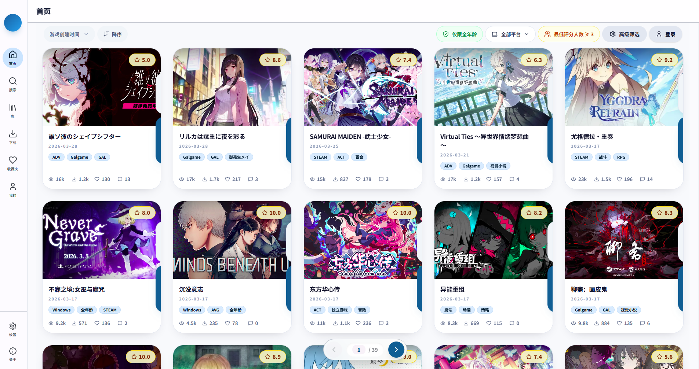

<div align="center">

# TouchGal Local Manager

**桌面端的 TouchGal 本地管理器 —— 浏览、收藏、下载、解压、启动，一站完成。**

[](https://www.electronjs.org/)
[](https://react.dev/)
[](./LICENSE)
[]()

<!-- 👇 Replace with an actual screenshot of your app -->
 

</div>

---

## ✨ 特性一览

### 🔍 浏览与搜索
- 首页高级筛选：标签、年份、评分排序，全部在本地管线完成
- 独立搜索页：关键词模糊搜索、范围开关、上游排序、NSFW 域切换
- 搜索评分排序在本地候选集上重建，带实时进度与增量渲染
- 浏览状态持久化 —— 刷新、切页再回来，位置还在

### 📖 详情与截图
- 详情弹层集成：介绍、截图 / PV、分组资源链接、评分、评论
- 全屏截图查看器，支持左右箭头与键盘导航
- Session 感知门禁 —— 需要登录的社交数据在登录后自动刷新
- `Esc` 分层关闭：先关截图，再关详情

### ❤️ 收藏
- 本地收藏夹：免登录，SQLite 持久化
- 云端收藏夹：接入上游接口，支持分页浏览
- 两者并行展示在独立 Favorites 页面

### ⬇️ 下载与解压
- 持久化下载队列：暂停 / 恢复 / 重试 / 批量选择 / 文件删除
- 官方资源一键入队，社区资源仍走外部链接
- Quick-download 弹层展示完整 metadata（section / type / language / platform / 提取码 / 解压码）
- 自动解压到统一游戏容器：`download/<游戏>/` → `library/<游戏>/(base|fd|patch|resources)/`
- 有界递归解压（默认 3 层），失败时 toast 告警
- 解压器自动检测，回退顺序：Bandizip → 7-Zip

### 🎮 本地 Library
- `library/` 为默认监控根目录，自动有界递归扫描（最多 3 层）
- 紧凑游戏墙视图，支持标题 / alias 模糊搜索
- 排序：最近加入 / 最近打开
- 目录分类标记：`linked` · `orphaned` · `unresolved` · `broken`
- 卡片级快捷操作：打开目录、启动游戏

### 🔐 认证与 Session
- 主进程统一中转上游 API 与 session / token 规范化
- 启动时主进程重新验证登录状态，不盲信渲染层缓存
- 持久化 token + 认证 cookies，失效时自动清理

### ⚙️ 设置
- 可配置：下载目录、详情页右键行为、下载并发数、递归解压层数
- Library 管理入口模式切换（popup / 独立窗口）
- 独立维护动作：清空数据库 / 清空缓存

---

## 🛠 技术栈

| 层 | 技术 |
|----------|--------------------------|
| 框架 | Electron 41 · electron-vite 5 |
| 前端 | React 19 · Vite 7 · Tailwind CSS 4 |
| 状态管理 | Zustand 5 |
| 本地存储 | better-sqlite3 |

---

## 🚀 快速开始

> **环境要求：** Node.js 21.7+，pnpm

```bash
# 安装依赖
pnpm install

# 开发模式
pnpm dev

# 类型检查 & Lint
pnpm typecheck
pnpm lint
```

### 构建

```bash
# 通用构建
pnpm build

# Windows 64 位安装包（NSIS .exe，输出到 release/0.1.0/）
pnpm build:win

# Linux
pnpm build:linux
```

---

## 🗺 路线图

| 状态 | 计划 |
|:---:|------|
| 🔜 | 更广泛的本地 metadata cache |
| 🔜 | 本地优先 / 离线友好浏览路径 |
| 🔜 | 深层未知来源本地目录匹配（当前以 `.tg_id` 为主链路） |

---

## ⚠️ 已知限制

- **评分排序的完整性**受限于上游候选集 —— 本地管线能修复页序漂移与去重，但无法补回上游未返回的资源
- 首页 feed 卡片目前仅显示 `/api/galgame` 返回的标签子集，更完整标签可能只存在于 `/api/patch/introduction`
- `reference_project/` 为参考材料，已被 lint 规则排除

---

## 📚 文档

深入了解架构与设计决策：

- [总览](docs/README.md)
- [架构](docs/architecture.md)
- [高级筛选](docs/advanced-filter.md)
- [设计决策](docs/decisions.md)
- [样式规范](docs/styling.md)

---

## 🙏 致谢与免责

<table>
  <tr>
    <td align="center">Made with ❤️ by <strong>Meiko Mei</strong></td>
  </tr>
</table>

- **原站：** [touchgal.top](https://www.touchgal.top/)
- **仓库：** [GitHub](https://github.com/MeikoMei16/touchgal-local-manager)

> 本项目是开源且免费的**第三方**桌面工具，非 TouchGal 官方客户端。
> 游戏资源、站点内容、接口数据、名称与相关归属，均以原站及原权利人为准；本项目仅提供本地管理与桌面交互层。
>
> 本项目由 [Linux.do](https://linux.do/) 社区激励实现。学 AI，上 L 站！真诚、友善、团结、专业，共建你我引以为荣之社区。

---

## 📄 Lint 说明

仓库中的 `reference_project/` 目录为参考材料，`pnpm lint` 已排除该目录，聚焦应用本身。
