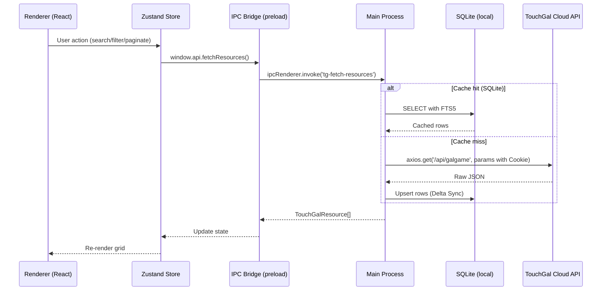

# Project Architecture

> **Stack**: Electron 41 · Vite 7 · React 19 · SQLite (better-sqlite3) · Tailwind CSS 4

TouchGal Local Manager is a **local-first** desktop application. The cloud is a sync source, not a runtime dependency. All personal data stays on-device.

---

## 1. Process Model

### 1.1 Main Process (`src/main/`)
- **Responsibility**: System I/O, IPC dispatch, window management, native API access.
- **Bootstrapping**: Bundled by Vite as native ESM. Reads `VITE_DEV_SERVER_URL` in development.
- **Key Modules**:
    - `index.ts`: Entry point and window orchestration.
    - `db.ts`: SQLite read/write operations (with local detail caching).
    - `downloader.ts`: Integrated download orchestration engine.
    - `logs/`: Unified logging stream (~/.config/touchgal-local-manager/logs/).
- **CORS Bypass**: All external API calls (TouchGal Cloud) are performed here to avoid browser security restrictions.

### 1.2 Preload Script (`src/preload/index.ts`)
- **Responsibility**: Security bridge between the sandboxed renderer and the main process.
- **Security**: Exposes a typed `window.api` object via `contextBridge`.
- **Packaging**: Bundled as `preload.cjs` (CommonJS) to ensure compatibility with Electron's preload requirements.

### 1.3 Renderer Process (`src/renderer/`)
- **Responsibility**: UI and interaction logic using React 19 and Tailwind CSS 4.
- **State Management**: Zustand lightweight reactive store.
- **Environment**: Sandboxed, no direct Node.js access; all system calls go through `window.api`.

---

## 2. Data Flow (Hybrid Model)

We use a **Hybrid Cache Model** where the app mirrors cloud metadata locally while following strict API protocols for real-time browsing.



---

## 3. Core Feature Pillars

### A — SQLite Metadata Store
Local mirror of cloud metadata with **FTS5 full-text search**. Enables offline browsing and sub-100ms query responses.

### B — Media Proxy & Cache
Background pre-fetching of banners and screenshots to eliminate loading spinners during navigation.

### C — Smart File Linking
Fuzzy-matches local game folders to cloud `uniqueId` via file fingerprinting. Bridges the gap between local files and the cloud catalog.

### D — Integrated Launcher
Executes games directly with locale emulation detection and save-file path management.

### E — Download Orchestration Engine
Integrated manager that parses multi-storage links, manages queues, verifies file integrity (size/hash), and performs auto-extraction (.rar/.7z).

### F — Play-Time Tracking & Personal Analytics
Tracks play sessions via process lifecycle hooks. Records duration, completion status, personal ratings, and private notes stored locally.

### G — Relational Knowledge Graph
Relational schema materializing game → company → tag → series relationships for "find similar" and discovery features.

---

## 4. SQLite Schema Highlights

```sql
-- Core catalog with FTS5
CREATE TABLE games (
    id INTEGER PRIMARY KEY,
    unique_id TEXT UNIQUE NOT NULL,
    name TEXT NOT NULL,
    banner_url TEXT,
    avg_rating REAL,
    view_count INTEGER DEFAULT 0,
    download_count INTEGER DEFAULT 0,
    detail_json TEXT,
    cloud_updated_at DATETIME,
    last_detailed_at DATETIME,
    local_updated_at DATETIME DEFAULT CURRENT_TIMESTAMP
);
CREATE VIRTUAL TABLE games_fts USING fts5(name, content='games', content_rowid='id');

-- Local installation and tracking
CREATE TABLE local_paths (
    id INTEGER PRIMARY KEY AUTOINCREMENT,
    game_id INTEGER REFERENCES games(id),
    path TEXT NOT NULL,
    exe_path TEXT,
    size_bytes INTEGER,
    linked_at DATETIME DEFAULT CURRENT_TIMESTAMP
);

CREATE TABLE play_sessions (
    id INTEGER PRIMARY KEY AUTOINCREMENT,
    game_id INTEGER REFERENCES games(id),
    started_at DATETIME NOT NULL,
    ended_at DATETIME
);
```

---

## 5. Design Principles
1. **Local-First**: Fully functional without internet. Cloud is a sync source only.
2. **Zero Data Loss**: Personal metadata (notes, ratings, play-time) survives reinstalls.
3. **Respectful Sync**: No personal data leaves the device without explicit consent.
4. **Performance Budget**: All UI interactions must respond in < 100ms.
