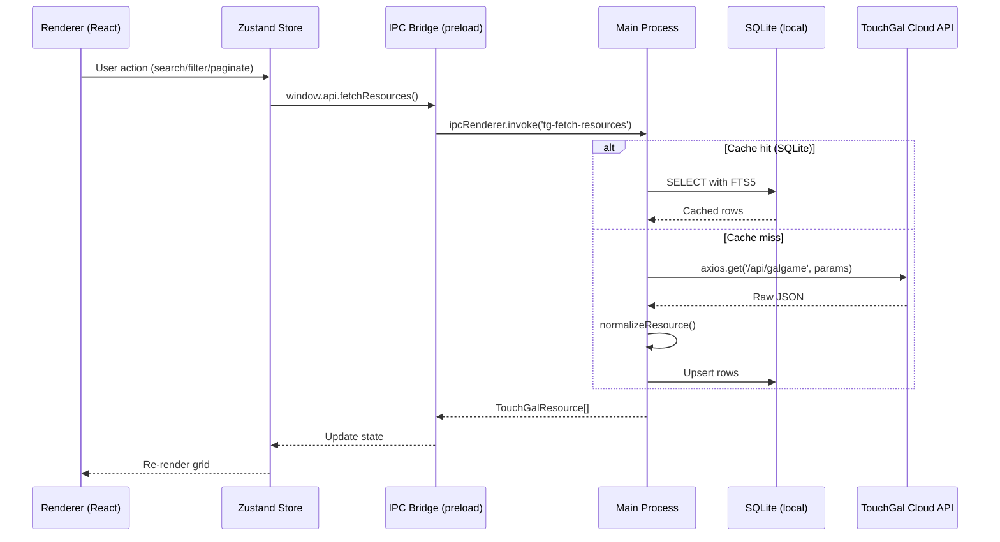

# Project Architecture

> **Stack**: Electron 31 · Vite 7 · React 19 · SQLite (better-sqlite3)

TouchGal Local Manager is a **local-first** desktop application. The cloud is a sync source, not a runtime dependency. All personal data stays on-device.

---

## Process Model

### 1. Main Process (`src/main/index.ts`)
- **Responsibility**: System I/O, IPC dispatch, window management, native API access.
- **Bootstrapping**: Bundled by Vite as native ESM. Reads `VITE_DEV_SERVER_URL` in development.
- **APIs**: Exposes functionality to the renderer via `ipcMain.handle`.
- **Key responsibilities added**: SQLite read/write, download queue, process launcher, file-system watcher.

### 2. Preload Script (`src/preload/index.ts`)
- **Responsibility**: Bridge between the sandboxed renderer and the main process.
- **Security**: Exposes a typed `window.api` object via `contextBridge`.
- **Packaging**: Bundled as `preload.cjs` (CommonJS, per `electron.vite.config.ts`).

### 3. Renderer Process (`src/renderer/`)
- **Responsibility**: UI and interaction logic (React 19).
- **Environment**: Sandboxed, no direct Node.js access.
- **Communication**: All system calls go through `window.api`.

---

## Core Technologies

| Layer | Technology | Role |
|:---|:---|:---|
| Shell | Electron 41 | OS integration, IPC bridge |
| Bundler | Vite 8 (Rolldown) | HMR in dev, optimized prod bundles |
| UI | React 19 | Component rendering |
| State | Zustand | Lightweight reactive store |
| Local DB | SQLite (better-sqlite3) | Metadata mirror, FTS5, personal data |
| Styling | Vanilla CSS (M3 tokens) | Desktop aesthetics |
| Networking | Axios (Main Process only) | CORS-free API calls |

---

## Data Flow



## API Surface
| Method | Endpoint | Purpose |
|:---|:---|:---|
| fetchGalgameResources | /api/galgame | Browse with multi-dim filters |
| searchResources | /api/search | Full-text keyword search |
| getPatchDetail | /api/patch/[id] | Single resource metadata |
| getPatchIntroduction | /api/patch/[id]/introduction | Rich description + aliases |
| fetchCaptcha | /api/auth/captcha | Login flow |
| login | /api/auth/login | User authentication |
| getRanking | /api/ranking | Leaderboard (rating/views/downloads) |
| getPatchResources | /api/patch/[id]/resource | Download links (multi-storage) |

---

## Local Feature Pillars

### A — SQLite Metadata Store
Local mirror of cloud metadata with FTS5 full-text search. Enables offline browsing and sub-100ms query response.

### B — Media Proxy & Cache
Background pre-fetching of banners and screenshots. Eliminates loading spinners during navigation.

### C — Smart File Linking
Fuzzy-matches local game folders to cloud uniqueId via file fingerprinting. Bridges the gap between downloaded files and the cloud catalog.

### D — Integrated Launcher
Executes games directly with locale emulation detection and save-file path management.

### E — Download Orchestration Engine
Parses multi-storage links (Baidu Pan, Mega, Google Drive, OneDrive) from resource.storage. Provides queue management, pause/resume, integrity verification (size/hash), auto-extraction (.rar/.7z), and post-download auto-linking.

### F — Play-Time Tracking & Analytics
Tracks play sessions via process lifecycle hooks. Records start/stop timestamps, completion status, personal ratings, and private notes — all local, never synced.

### G — Relational Knowledge Graph
SQLite relational schema materializing game → company → tag → series relationships. Enables "find similar" queries, company timelines, and tag co-occurrence analysis.

---

## SQLite Schema (Consolidated)

```sql
-- Core catalog
CREATE TABLE games (
    id INTEGER PRIMARY KEY,
    unique_id TEXT UNIQUE NOT NULL,
    name TEXT NOT NULL,
    banner_url TEXT,
    avg_rating REAL,
    view_count INTEGER DEFAULT 0,
    download_count INTEGER DEFAULT 0,
    cloud_updated_at DATETIME,
    local_updated_at DATETIME DEFAULT CURRENT_TIMESTAMP
);
CREATE VIRTUAL TABLE games_fts USING fts5(name, content='games', content_rowid='id');

-- Relations
CREATE TABLE companies (
    id INTEGER PRIMARY KEY,
    name TEXT NOT NULL,
    parent_brand_id INTEGER REFERENCES companies(id),
    primary_language TEXT,
    official_website TEXT
);
CREATE TABLE tags (id INTEGER PRIMARY KEY, name TEXT NOT NULL UNIQUE);
CREATE TABLE game_tags (
    game_id INTEGER REFERENCES games(id),
    tag_id INTEGER REFERENCES tags(id),
    PRIMARY KEY(game_id, tag_id)
);
CREATE TABLE game_series (
    game_id INTEGER REFERENCES games(id),
    series_id INTEGER REFERENCES series(id),
    order_in_series INTEGER
);

-- External IDs
CREATE TABLE external_ids (
    game_id INTEGER REFERENCES games(id),
    vndb_id TEXT, bangumi_id INTEGER, steam_id TEXT, dlsite_code TEXT
);

-- Local installation
CREATE TABLE local_paths (
    id INTEGER PRIMARY KEY AUTOINCREMENT,
    game_id INTEGER REFERENCES games(id),
    path TEXT NOT NULL,
    exe_path TEXT,
    size_bytes INTEGER,
    linked_at DATETIME DEFAULT CURRENT_TIMESTAMP
);

-- Media cache
CREATE TABLE media_cache (
    game_id INTEGER PRIMARY KEY REFERENCES games(id),
    banner_local_path TEXT,
    screenshots_json TEXT,
    cached_at DATETIME
);

-- Download queue
CREATE TABLE download_tasks (
    id INTEGER PRIMARY KEY AUTOINCREMENT,
    game_id INTEGER REFERENCES games(id),
    storage_url TEXT NOT NULL,
    status TEXT CHECK(status IN ('queued','downloading','paused','verifying','extracting','done','error')),
    progress_bytes INTEGER DEFAULT 0,
    total_bytes INTEGER,
    created_at DATETIME DEFAULT CURRENT_TIMESTAMP
);

-- Play tracking
CREATE TABLE play_sessions (
    id INTEGER PRIMARY KEY AUTOINCREMENT,
    game_id INTEGER REFERENCES games(id),
    started_at DATETIME NOT NULL,
    ended_at DATETIME,
    duration_minutes INTEGER GENERATED ALWAYS AS
        (CAST((julianday(ended_at) - julianday(started_at)) * 1440 AS INTEGER)) STORED
);
CREATE TABLE personal_metadata (
    game_id INTEGER PRIMARY KEY REFERENCES games(id),
    completion_status TEXT CHECK(completion_status IN
        ('not_started','playing','completed','dropped','perfectionist')),
    personal_rating REAL CHECK(personal_rating BETWEEN 0 AND 10),
    notes TEXT,
    last_played_at DATETIME
);

-- Collections
CREATE TABLE collections (id INTEGER PRIMARY KEY AUTOINCREMENT, name TEXT NOT NULL);
CREATE TABLE collection_items (
    collection_id INTEGER REFERENCES collections(id),
    game_id INTEGER REFERENCES games(id),
    PRIMARY KEY(collection_id, game_id)
);
```

---

## Implementation Roadmap

| Phase | Scope | Status | Effort |
|:---|:---|:---|:---|
| Phase 1 | SQLite metadata mirror + delta sync | ✅ Completed | 2 weeks |
| Phase 2 | Smart file linking + launcher | ✅ Completed | 1 week |
| Phase 3 | Download orchestration engine | ✅ Completed | 2 weeks |
| Phase 4 | Play-time tracking + analytics dashboard | 🟡 High | 1 week |
| Phase 5 | Relational knowledge graph + "find similar" | 🟢 Medium | 1 week |
| Phase 6 | Cross-DB federation (VNDB / Bangumi) | 🟢 Medium | 2 weeks |
| Phase 7 | Plugin system | 🔵 Future | 3 weeks |

---

## Design Principles
1. **Local-First**: Fully functional without internet. Cloud is a sync source only.
2. **Zero Data Loss**: Personal metadata survives reinstalls. Export to `.touchgal-backup`.
3. **Respectful Sync**: No personal data leaves the device without explicit user consent.
4. **Progressive Enhancement**: Start in cloud-proxy mode; enable local features as SQLite mirror matures.
5. **Performance Budget**: All UI interactions must respond in < 100ms. Use skeleton UI for slower queries.
