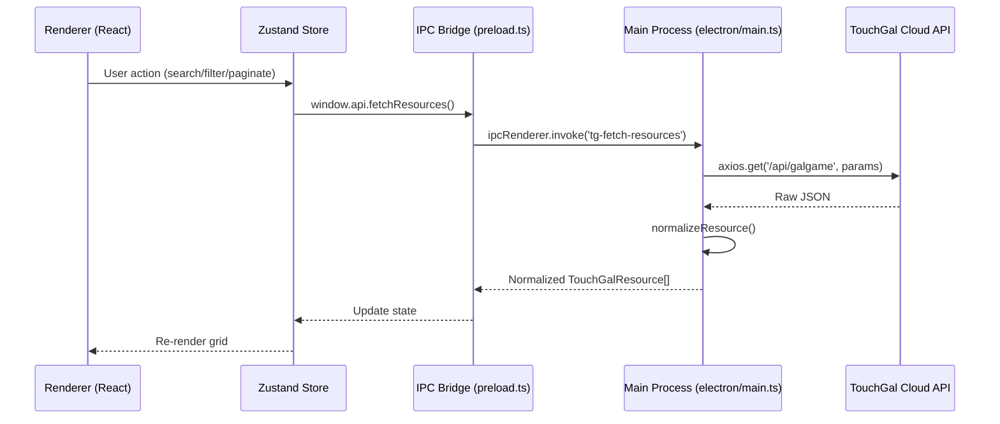
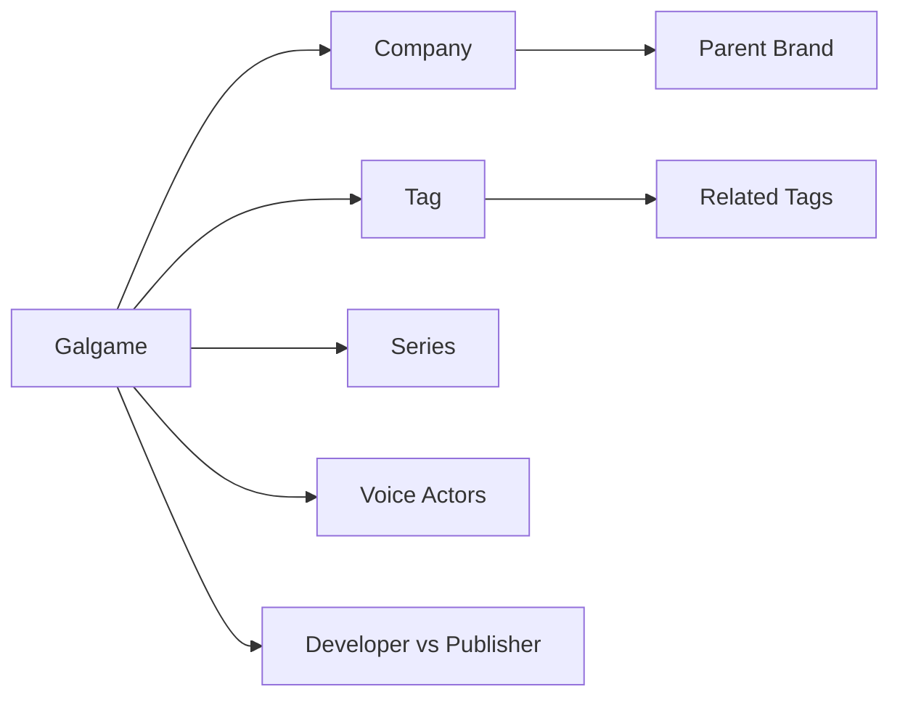
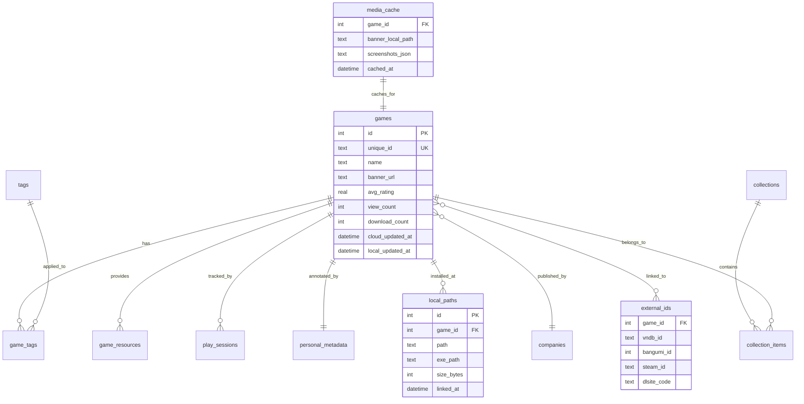

# TouchGal Local Manager — Complete Architecture Blueprint

> **Audience**: This document is designed for deep architectural review. It covers the current state, reference analysis, existing proposals, and **novel desktop-exclusive capabilities** that go beyond what a web app can achieve.

---

## Part I: Current State Analysis

### 1.1 Tech Stack
| Layer | Technology | Role |
|:---|:---|:---|
| UI | React 18 + Vite | Component rendering, HMR |
| State | Zustand | Lightweight reactive store |
| Shell | Electron 28 | OS integration, IPC bridge |
| Styling | Vanilla CSS (M3 tokens) | Premium desktop aesthetics |
| Network | Axios (Main Process) | CORS-free API calls |

### 1.2 Current Data Flow


### 1.3 Current API Surface (Our Client)
| Method | Endpoint | Purpose |
|:---|:---|:---|
| `fetchGalgameResources` | `/api/galgame` | Browse with filters |
| `searchResources` | `/api/search` | Full-text keyword search |
| `getPatchDetail` | `/api/patch/[id]` | Single resource metadata |
| `getPatchIntroduction` | `/api/patch/[id]/introduction` | Extended description + aliases |
| `fetchCaptcha` | `/api/auth/captcha` | Login flow |
| `login` | `/api/auth/login` | User authentication |

---

## Part II: Reference Project Deep-Dive (`kun-touchgal-next`)

### 2.1 Full API Topology (18 Endpoints)
```
/api
├── galgame/          ← Browse + multi-dim filter (type, lang, platform, year, month, rating)
├── search/           ← Full-text search with same filter intersection
├── ranking/          ← Leaderboard (sort by: rating, rating_count, like, favorite, resource, comment, download, view)
├── patch/
│   ├── [id]          ← Core metadata
│   ├── banner/       ← Cover image management
│   ├── comment/      ← Per-patch comment thread
│   ├── favorite/     ← Multi-folder collection system
│   ├── feedback/     ← User feedback/reports
│   ├── introduction/ ← Rich text description
│   ├── rating/       ← User ratings with recommend levels
│   ├── resource/     ← Download links (multi-storage)
│   └── views/        ← View count tracking
├── company/          ← Publisher/developer CRUD with parent-brand hierarchy
├── tag/              ← Tag taxonomy
├── comment/          ← Global comment feed
├── user/             ← User profiles
├── auth/             ← Login/register/forgot
├── admin/            ← Moderation tools
├── upload/           ← File upload service
├── home/             ← Homepage aggregation
├── message/          ← User notifications
└── edit/             ← Content editing history
```

### 2.2 Key Architectural Insight
The reference project is **stateless by necessity**: every UI interaction triggers a fresh server query because the browser cannot persist or index data locally. This is not a feature—it's a constraint. Our desktop app can do better.

---

## Part III: Four Existing Pillars (Previously Documented)

| # | Pillar | Summary |
|:---|:---|:---|
| A | **SQLite Metadata Store** | Local mirror of cloud metadata with FTS5 full-text search for offline/instant queries |
| B | **Media Proxy & Cache** | Background pre-fetching of banners + screenshots for spinner-free browsing |
| C | **Smart File Linking** | Fuzzy-match local game folders to cloud `uniqueId` via file fingerprinting |
| D | **Integrated Launcher** | Direct game execution with locale emulation detection and save-file management |

---

## Part IV: Novel Desktop-Exclusive Capabilities

### 4.1 Relational Knowledge Graph

> **What the web app can't do**: It treats each resource as an isolated card. There's no way to explore "all games by the same company" or "games sharing 3+ tags with this one."

**Proposal**: Build a local graph database (or SQLite relational schema) that materializes the relationships between:



**Desktop-Only Features**:
- "Find similar" button: Queries the local graph for games sharing ≥3 tags, same company, or same series
- Company timeline view: Chronological visualization of a publisher's entire catalog
- Tag co-occurrence heatmap: Discover which tag combinations correlate with high ratings

**Schema Sketch**:
```sql
CREATE TABLE companies (
    id INTEGER PRIMARY KEY,
    name TEXT NOT NULL,
    parent_brand_id INTEGER REFERENCES companies(id),
    primary_language TEXT,
    official_website TEXT
);

CREATE TABLE game_tags (
    game_id INTEGER REFERENCES games(id),
    tag_id INTEGER REFERENCES tags(id),
    PRIMARY KEY(game_id, tag_id)
);

CREATE TABLE game_series (
    game_id INTEGER REFERENCES games(id),
    series_id INTEGER REFERENCES series(id),
    order_in_series INTEGER
);
```

---

### 4.2 Download Orchestration Engine

> **What the web app can't do**: It can only display a link. The user must manually navigate to a cloud storage site, solve CAPTCHAs, and manage downloads externally.

**Proposal**: An integrated download manager that:
1. **Parses multi-storage links**: Detects Baidu Pan, Mega, Google Drive, OneDrive URLs from the `resource.storage` field
2. **Queue management**: Priority queuing, pause/resume, bandwidth throttling
3. **Integrity verification**: Compares downloaded file size/hash against the `resource.size` metadata
4. **Auto-extraction**: Detects `.rar`/`.7z` archives and offers one-click extraction to the game library path
5. **Post-download linking**: Automatically associates the extracted folder with the cloud `uniqueId`, completing the Smart Linking pipeline without manual intervention

**Data Flow**:
```
Resource Card [Download] → Parse storage URLs → Enqueue →
Background Download (aria2/electron-dl) → Verify → Extract →
Auto-link to SQLite game entry → Update UI status badge
```

---

### 4.3 Play-Time Tracking & Personal Analytics

> **What the web app can't do**: Zero visibility into actual user engagement. Rating is the only signal.

**Proposal**: Since we own the process launcher, we can track:
- **Play sessions**: Start/stop timestamps, total hours per game
- **Completion status**: User-defined (Not Started / Playing / Completed / Dropped / 100%)
- **Personal ratings & notes**: Private annotations that never leave the local DB
- **Analytics dashboard**:
  - "Games played this month" chart
  - "Average session length" trends
  - "Genre distribution" pie chart based on tags of played games
  - "Backlog size" vs "Completion rate"

**Schema Sketch**:
```sql
CREATE TABLE play_sessions (
    id INTEGER PRIMARY KEY AUTOINCREMENT,
    game_id INTEGER REFERENCES games(id),
    started_at DATETIME NOT NULL,
    ended_at DATETIME,
    duration_minutes INTEGER GENERATED ALWAYS AS
        (CAST((julianday(ended_at) - julianday(started_at)) * 1440 AS INTEGER)) STORED
);

CREATE TABLE personal_metadata (
    game_id INTEGER PRIMARY KEY REFERENCES games(id),
    completion_status TEXT CHECK(completion_status IN
        ('not_started', 'playing', 'completed', 'dropped', 'perfectionist')),
    personal_rating REAL CHECK(personal_rating BETWEEN 0 AND 10),
    notes TEXT,
    last_played_at DATETIME
);
```

---

## Part V: Proposed SQLite Schema (Consolidated)



---

## Part VI: Implementation Roadmap

| Phase | Scope | Priority | Effort |
|:---|:---|:---|:---|
| **Phase 1** | SQLite metadata mirror + delta sync | 🔴 Critical | 2 weeks |
| **Phase 2** | Smart file linking + launcher | 🔴 Critical | 1 week |
| **Phase 3** | Download orchestration | 🟡 High | 2 weeks |
| **Phase 4** | Play-time tracking + analytics | 🟡 High | 1 week |
| **Phase 5** | Relational knowledge graph | 🟢 Medium | 1 week |
| **Phase 6** | Cross-DB federation (VNDB/Bangumi) | 🟢 Medium | 2 weeks |
| **Phase 7** | Plugin system | 🔵 Future | 3 weeks |

---

## Part VII: Key Design Principles

1. **Local-First**: The app must be fully functional without internet. Cloud is a sync source, not a dependency.
2. **Zero Data Loss**: Personal metadata (notes, ratings, play-time) must survive app reinstalls. Consider exporting to a `.touchgal-backup` file.
3. **Respectful Sync**: Never upload personal/local data to the cloud without explicit user consent.
4. **Progressive Enhancement**: Start with cloud-proxy mode (current), then progressively enable local features as the SQLite mirror matures.
5. **Performance Budget**: Any UI interaction must respond in < 100ms. If a query takes longer, show skeleton UI and stream results.
